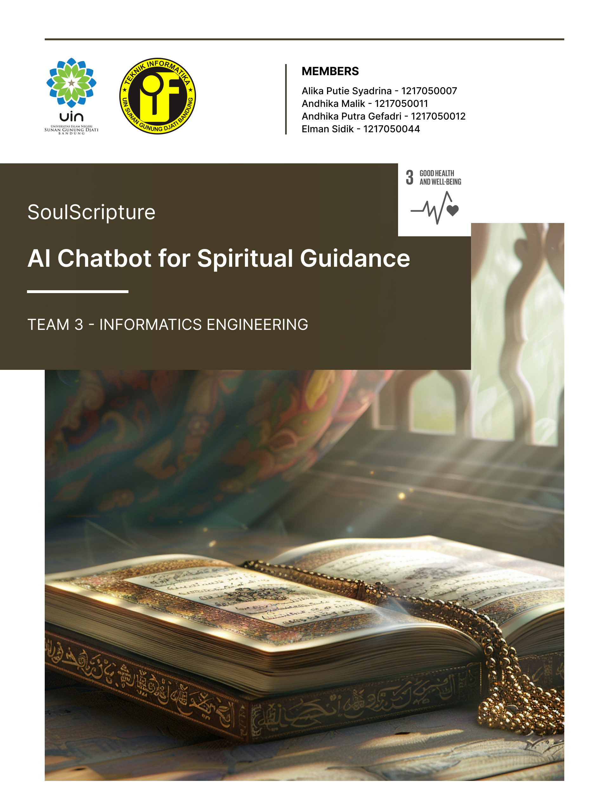

# SoulScripture - AI Chatbot for Spiritual Guidance
## Generative Model (Text)
SoulScripture combines self-supervised learning technology to comprehend Hadith texts without requiring external annotations or human assistance. By leveraging methods such as text encoding and vector representation, SoulScripture can extract patterns and key information from Hadith texts, enabling it to provide accurate and efficient responses to questions or searches.

